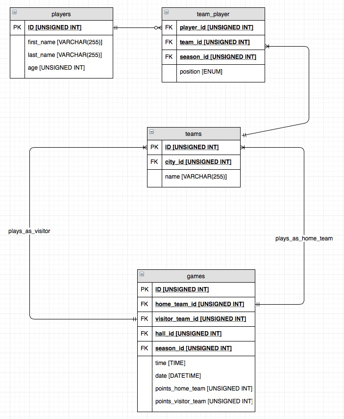

# Assignment - Senior Developer @ SmartHook

### 1. Design a SQL database to store NBA players, teams and games (column and table contents are all up to you). Users mostly query game results by date and team name. The second most frequent query is players statistics by player name.
#### Domain structure
The business domain can be represented by following facts:
* a player belongs to a team
* every team must have at least 1 player (technically, a team must have 12 players, but I would implement this rule programmatically )
* a player can only be in one team in a given season (pivot table between players and games should have a composite primary key that consists of player_id, 
team_id and season_id)
* teams play matches as a home team and a visitor team
* matches are played on a certain date at a certain time and in a certain hall

An ER diagram for above mentioned business domain would look something like this:

  or  

#### Applying indexes for query optimization

As users search for player stats by their first name and last name I would apply an INDEX for first_name and last_name attribute like so:
```sql
ALTER TABLE players ADD INDEX fn_players_md5(MD5(first_name));
ALTER TABLE players ADD INDEX ln_players_md5(MD5(last_name));
```
Notice that both of them are hashing indexes. As first_name and last_name attributes are of type VARCHAR(255) we would not accomplish much
by indexing them. Instead, we can hash the attributes with a hashing algorithms (e.g. MD5, which produces a string with fixed length of 16 bytes).
We should keep that in mind when constructing the SELECT statement as we would have to hash the attributes for these indexes to work. Assuming we have
player_stats table, we should also create an index on player_id in stats table like so:
```sql
ALTER TABLE player_stats ADD INDEX pid_stats(player_id);
```
We can then fetch the statistics for a player given this SELECT statement:
```sql
SELECT * FROM player_stats 
WHERE player_id = players.id AND players.first_name LIKE '%{{ name }}%' OR players.last_name LIKE '%{{ name }}%'; 
```
For querying game results by game date and team name I would utilize 2 indexes (1 normal and 1 composite):
```sql
ALTER TABLE teams ADD INDEX name_teams_md5(MD5(name));
ALTER TABLE games ADD INDEX date_tid_games(date, team_id);
```
This way we first query results with this SELECT statement:
```sql
SELECT points_home_team, points_visitor_team FROM games 
WHERE teams.name LIKE '%{{ pattern }}%' AND teams.id = games.team_id and games.date = {{ date }};
```
#### Further notices
Using event sourcing for game statistics would greatly improve our data persistence strategy. We could record each state of truth
to, say events table and calculate statistics (like scores, fouls, etc.) from it using a map-reduce functional pattern. 

### 2. How would you find files that begin with "0aH" and delete them given a folder (with subfolders)? Assume there are many files in the folder.
Solving this problem requires recursive approach and basic knowledge of regular expressions. I will write pseudo-code for this problem as a PHP implementation would result in using 
SPL library classes like RecursiveDirectoryIterator and RecursiveCallbackFilterIterator.

```
function deleteFilesByPattern (path, pattern):
    let dirElements = scanDir(path);
    while (dirElements.hasNext() == TRUE) do:
        let element = dirElements.current();
        if (element.isDir()):
            deleteFilesByPattern(element.getPath(), pattern);
        else:
            if (matchByRegex (element.name(), pattern) == TRUE):
                deleteFile (element);
        endif;
        dirElements.next();
    endwhile;
```
```
// Call function with regex on current path /some/path
deleteFiles ('/some/path', '/^0aH/');
```
### 3. Write a function that sorts 11 small numbers (<100) as fast as possible. Estimate how long it would take to execute that function 10 Billion (10^10) times on a normal machine?
For the specified sorting problem I used QuickSort algorithm which utilizes "divide and conquer" concept and has several good features:
* average time complexity of Θ(n log(n)) for random distribution of numbers (accomplished by using in-place QuickSort with Lomuto Partitioning strategy along with Random Index Pivot strategy)
* quite low memory overhead - in the order of O(log n) due to stack frames for recursive calls
* quite easy to implement

First, I implemented diefferent strategies of calculating a pivot:
```php
interface PivotStrategy {
    public function fetch(array $data, int $left, int $right) : int;
}

class RandomPivotIndex implements PivotStrategy {
    public function fetch(array $data, int $left, int $right): int
    {
        // $left shifts shifts random index searching
        return random_int (0, $right - $left) + $left;
    }
}
```
The next step consisted of implementing the Partition strategy:
```php
interface Partition {

    /**
     * @param array $data
     * @param int   $left
     * @param int   $right
     * @param int   $pivotIndex
     * @return int $index [Index location where the pivot gets placed]
     */
    public function apply(array &$data, int $left, int $right, int $pivotIndex) : int;
}

class LomutoPartition implements Partition {

    /**
     * @param array $data
     * @param int   $left
     * @param int   $right
     * @param int   $pivotIndex
     * @return int $storeIndex [Index location where the pivot gets placed]
     */
    public function apply(array &$data, int $left, int $right, int $pivotIndex): int
    {
        $pivotValue = $data[$pivotIndex];
        $this->swap($data, $pivotIndex, $right);
        $storeIndex = $left;

        // Put every value smaller than $pivotValue to the left side of array
        for($i = $left; $i < $right; $i++) {
            if($data[$i] < $pivotValue) {
                $this->swap($data, $i, $storeIndex);
                $storeIndex++;
            }
        }

        $this->swap($data, $storeIndex, $right);

        return $storeIndex;
    }

    private function swap(array &$arr, int $index1, int $index2) {
        $temp = $arr[$index1];
        $arr[$index1] = $arr[$index2];
        $arr[$index2] = $temp;
    }
    
    
}
```
This way, implementing QuickSort algorithm becomes trivial:
```php
function sortNumbers(array &$data, int $left, int $right, PivotStrategy $pivotStrategy, Partition $partition)
{
    if(! count($data) || $left >= $right) {
        // Data is sorted
        return;
    }
    $randomIndex = $pivotStrategy->fetch($data, $left, $right);
    $pivot = $partition->apply($data, $left, $right, $randomIndex);
    printArray("Current sorting status: ", $data);

    // Divide and conquer
    sortNumbers($data, $left, $pivot - 1, $pivotStrategy, $partition);
    sortNumbers($data, $pivot + 1, $right, $pivotStrategy, $partition);
}
```
And calling it looks something like this:
```php
$numbers = array_map(function() {
    return rand(0,99);
}, range(0,10));
printArray("Random array to sort: ", $numbers);
sortNumbers($numbers, 0, count($numbers) - 1, new RandomPivotIndex, new LomutoPartition);
printArray("Sorted array is: ", $numbers);


function printArray(string $message, array $array) {
    echo $message . "[" . implode(', ', $array) . "]\n";
}
```
Time complexity for in-place QuickSort with random pivot index is T(n) = O(1.386 n log n) units of time (source: Wikipedia), where n is the number
of values that need to be sorted.

If we were to sort 1 billion numbers this algorithm would fail because we cannot store such large amount of elements in-memory
(1 billion integers would require around 34GB of memory in PHP). Thus, something like MergeSort would be appropriate for the task. MergeSort
is great for sorting elements from slow memory such as disks and has time complexity in the order of Θ(n), where n
is the number of elements that need to be sorted. 

### 4. Write a function that sorts 10000 powers (a^b) where a and b are random numbers between 100 and 10000? Estimate how long it would take on your machine?
At first glance, this problem seems impossible to solve. Calculating the lowest power (which is 100^100) would require quite
some time (as calculating 3^40 requires approximately 400 thousand years). As such, the algorithm would have time complexity in the order of O(a^b)
just to calculate the value for the given base (a) and exponent (b) pair. We call this problem NP as it requires polynomial time to check if the result is correct, but exponential time to get the result (we can postpone the task of solving P = NP millennium question to another day).
But there are techniques which we can use to avoid such high complexity. They are called problem translations. As we know, exponential function is an increasing function and has
an inverse logarithmic function (which is also increasing). This means than if a1^b1 < a2^b2 holds, then b1 * log(a1) < b2 * log(a2) also holds.
Translating exponential function to a logarithmic one results in fairly easily solvable problem as we can sort the given pairs based on their logarithmic values using any sorting algorithm. Below is the implementation of
such algorithm:
```php
function sortExponents(int $amount, int $minRange, int $maxRange, PivotStrategy $pivotStrategy, Partition $partition) {

    $logarithmicVals = [];
    $powers = array_map(function() use ($minRange, $maxRange, &$logarithmicVals) {
        $a = random_int($minRange, $maxRange);
        $b = random_int($minRange, $maxRange);
        $logarithmicVals[] = $b * log($a);
        return  "$a^$b";
    }, range(0, $amount - 1));

    // Map logarithmic values to their power representations.
    $valueMap = array_combine(array_map('md5', $logarithmicVals), $powers);

    printArray("Array represenatation: ", $powers);

    sortNumbers($logarithmicVals, 0, count($logarithmicVals) - 1, $pivotStrategy, $partition);

    // Find string representation of a value
    printArray("\nSorted array: ", array_map(function($v) use ($valueMap) {
        return $valueMap[md5($v)];
    }, $logarithmicVals));
}
```
As we can see, the amount of overhead we get in comparsion to sorting integers is just in calculating logarithmic values of random numbers a and b.
This operation adds O(n) to QuickSort time complexity. Calling sortExponents() requires one line of code:
```php
sortExponents(10000, 100, 10000, new RandomPivotIndex, new LomutoPartition);
```
### 5. write a 1 page high level description of your solution. Answer: - what you've built, which technologies you've used, how it is tied together (your reasons for high-level decisions)
